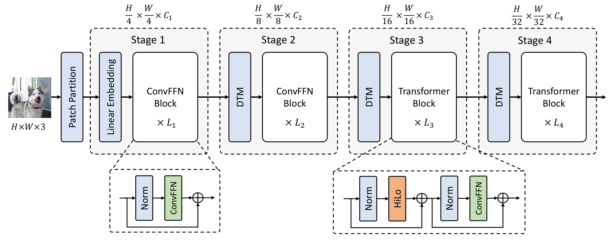
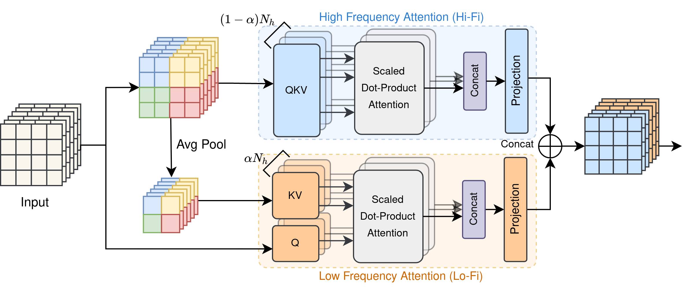

# Fast Vision Transformers  with HiLo Attention👋
[](https://opensource.org/licenses/Apache-2.0) 
<a href="https://pytorch.org/get-started/locally/"></a>

This is the official PyTorch implementation of [Fast Vision Transformers with HiLo Attention](https://arxiv.org/abs/2205.13213).

By [Zizheng Pan](https://scholar.google.com.au/citations?user=w_VMopoAAAAJ&hl=en), [Jianfei Cai](https://scholar.google.com/citations?user=N6czCoUAAAAJ&hl=en), and [Bohan Zhuang](https://scholar.google.com.au/citations?user=DFuDBBwAAAAJ).


## A Gentle Introduction




We introduce LITv2, a simple and effective ViT which performs favourably against the existing state-of-the-art methods across a spectrum of different model sizes with faster speed.



The core of LITv2: **HiLo attention** HiLo is inspired by the insight that high frequencies in an image capture local fine details and low frequencies focus on global structures, whereas a multi-head self-attention layer neglects the characteristic of different frequencies. Therefore, we propose to disentangle the high/low frequency patterns in an attention layer by separating the heads into two groups, where one group encodes high frequencies via self-attention within each local window, and another group performs the attention to model the global relationship between the average-pooled low-frequency keys from each window and each query position in the input feature map. 


## News

- **16/06/2022.** We release the source code for classification/detection/segmentation, along with the pretrained weights. Any issues are welcomed!


## Installation

### Requirements

- Linux with Python ≥ 3.6
- PyTorch 1.8.1
- CUDA 11.1
- An NVIDIA GPU

### Conda environment setup

**Note**: You can use the same environment to debug [LITv1](https://github.com/ziplab/LIT). Otherwise, you can create a new python virtual environment by the following script.

```bash
conda create -n lit python=3.7
conda activate lit

# Install Pytorch and TorchVision
pip install torch==1.8.1+cu111 torchvision==0.9.1+cu111 torchaudio==0.8.1 -f https://download.pytorch.org/whl/torch_stable.html

pip install timm==0.3.2
pip install ninja
pip install tensorboard

# Install NVIDIA apex
git clone https://github.com/NVIDIA/apex
cd apex
pip install -v --disable-pip-version-check --no-cache-dir --global-option="--cpp_ext" --global-option="--cuda_ext" ./
cd ../
rm -rf apex/

# Build Deformable Convolution
cd mm_modules/DCN
python setup.py build install

pip install opencv-python==4.4.0.46 termcolor==1.1.0 yacs==0.1.8
```


# Getting Started

For image classification on ImageNet, please refer to [classification](https://github.com/ziplab/LITv2/tree/main/classification).

For object detection on COCO 2017, please refer to [detection](https://github.com/ziplab/LITv2/tree/main/detection).

For semantic segmentation on ADE20K, please refer to [segmentation](https://github.com/ziplab/LITv2/tree/main/segmentation).


## Results and Model Zoo

**Note:** For your convenience, you can find all models and logs from [Google Drive](https://drive.google.com/drive/folders/1VAtrPWEqxi-6q6luwEVdYvkBYedApwbU?usp=sharing) (4.8G in total). Alternatively, we also provide download links from github.

### Image Classification on ImageNet-1K

All models are trained with 300 epochs with a total batch size of 1024 on 8 V100 GPUs.

| Model   | Resolution | Params (M) | FLOPs (G) | Throughput (imgs/s) | Train Mem (GB) | Test Mem (GB) | Top-1 (%) | Download                                                     |
| ------- | ---------- | ---------- | --------- | ------------------- | -------------- | ------------- | --------- | ------------------------------------------------------------ |
| LITv2-S | 224        | 28         | 3.7       | 1,471               | 5.1            | 1.2           | 82.0      | [model](https://github.com/ziplab/LITv2/releases/download/v1.0/litv2_s.pth) & [log](https://github.com/ziplab/LITv2/releases/download/v1.0/litv2_s_log.txt) |
| LITv2-M | 224        | 49         | 7.5       | 812                 | 8.8            | 1.4           | 83.3      | [model](https://github.com/ziplab/LITv2/releases/download/v1.0/litv2_m.pth) & [log](https://github.com/ziplab/LITv2/releases/download/v1.0/litv2_m_log.txt) |
| LITv2-B | 224        | 87         | 13.2      | 602                 | 12.2           | 2.1           | 83.6      | [model](https://github.com/ziplab/LITv2/releases/download/v1.0/litv2_b.pth) & [log](https://github.com/ziplab/LITv2/releases/download/v1.0/litv2_b_log.txt) |
| LITv2-B | 384        | 87         | 39.7      | 198                 | 35.8           | 4.6           | 84.7      | [model](https://github.com/ziplab/LITv2/releases/download/v1.0/litv2_b_384.pth) |

> By default, the throughput and memory footprint are tested on one RTX 3090 based on a batch size of 64. Memory is measured by the peak memory usage with `torch.cuda.max_memory_allocated()`. Throughput is averaged over 30 runs.

### Object Detection on COCO 2017

All models are trained with 1x schedule (12 epochs) with a total batch size of 16 on 8 V100 GPUs.

#### RetinaNet

| Backbone | Window Size | Params (M) | FLOPs (G) | FPS  | box AP | Config                                                       | Download                                                     |
| -------- | ----------- | ---------- | --------- | ---- | ------ | ------------------------------------------------------------ | ------------------------------------------------------------ |
| LITv2-S  | 2           | 38         | 242       | 18.7 | 44.0   | [config](https://github.com/ziplab/LITv2/blob/main/detection/configs/litv2/retinanet_litv2_s_fpn_1x_coco.py) | [model](https://github.com/ziplab/LITv2/releases/download/v1.0/retinanet_litv2_s_fpn_1x_coco.pth) & [log](https://github.com/ziplab/LITv2/releases/download/v1.0/retinanet_litv2_s_fpn_1x_coco_log.json) |
| LITv2-S  | 4           | 38         | 230       | 20.4 | 43.7   | [config](https://github.com/ziplab/LITv2/blob/main/detection/configs/litv2/retinanet_litv2_s_fpn_1x_coco_ws_4.py) | [model](https://github.com/ziplab/LITv2/releases/download/v1.0/retinanet_litv2_s_fpn_1x_coco_ws_4.pth) & [log](https://github.com/ziplab/LITv2/releases/download/v1.0/retinanet_litv2_s_fpn_1x_coco_ws_4_log.json) |
| LITv2-M  | 2           | 59         | 348       | 12.2 | 46.0   | [config](https://github.com/ziplab/LITv2/blob/main/detection/configs/litv2/retinanet_litv2_m_fpn_1x_coco.py) | [model](https://github.com/ziplab/LITv2/releases/download/v1.0/retinanet_litv2_m_fpn_1x_coco.pth) & [log](https://github.com/ziplab/LITv2/releases/download/v1.0/retinanet_litv2_m_fpn_1x_coco_log.json) |
| LITv2-M  | 4           | 59         | 312       | 14.8 | 45.8   | [config](https://github.com/ziplab/LITv2/blob/main/detection/configs/litv2/retinanet_litv2_m_fpn_1x_coco_ws_4.py) | [model](https://github.com/ziplab/LITv2/releases/download/v1.0/retinanet_litv2_m_fpn_1x_coco_ws_4.pth) & [log](https://github.com/ziplab/LITv2/releases/download/v1.0/retinanet_litv2_m_fpn_1x_coco_ws_4_log.json) |
| LITv2-B  | 2           | 97         | 481       | 9.5  | 46.7   | [config](https://github.com/ziplab/LITv2/blob/main/detection/configs/litv2/retinanet_litv2_b_fpn_1x_coco.py) | [model](https://github.com/ziplab/LITv2/releases/download/v1.0/retinanet_litv2_b_fpn_1x_coco.pth) & [log](https://github.com/ziplab/LITv2/releases/download/v1.0/retinanet_litv2_b_fpn_1x_coco_log.json) |
| LITv2-B  | 4           | 97         | 430       | 11.8 | 46.3   | [config](https://github.com/ziplab/LITv2/blob/main/detection/configs/litv2/retinanet_litv2_b_fpn_1x_coco_ws_4.py) | [model](https://github.com/ziplab/LITv2/releases/download/v1.0/retinanet_litv2_b_fpn_1x_coco_ws_4.pth) & [log](https://github.com/ziplab/LITv2/releases/download/v1.0/retinanet_litv2_b_fpn_1x_coco_ws_4_log.json) |

#### Mask R-CNN

| Backbone | Window Size | Params (M) | FLOPs (G) | FPS  | box AP | mask AP | Config                                                       | Download                                                     |
| -------- | ----------- | ---------- | --------- | ---- | ------ | ------- | ------------------------------------------------------------ | ------------------------------------------------------------ |
| LITv2-S  | 2           | 47         | 261       | 18.7 | 44.9   | 40.8    | [config](https://github.com/ziplab/LITv2/blob/main/detection/configs/litv2/mask_rcnn_litv2_s_fpn_1x_coco.py) | [model](https://github.com/ziplab/LITv2/releases/download/v1.0/mask_rcnn_litv2_s_fpn_1x_coco.pth) & [log](https://github.com/ziplab/LITv2/releases/download/v1.0/mask_rcnn_litv2_s_fpn_1x_coco_log.json) |
| LITv2-S  | 4           | 47         | 249       | 21.9 | 44.7   | 40.7    | [config](https://github.com/ziplab/LITv2/blob/main/detection/configs/litv2/mask_rcnn_litv2_s_fpn_1x_coco_ws_4.py) | [model](https://github.com/ziplab/LITv2/releases/download/v1.0/mask_rcnn_litv2_s_fpn_1x_coco_ws_4.pth) & [log](https://github.com/ziplab/LITv2/releases/download/v1.0/mask_rcnn_litv2_s_fpn_1x_coco_ws_4_log.json) |
| LITv2-M  | 2           | 68         | 367       | 12.6 | 46.8   | 42.3    | [config](https://github.com/ziplab/LITv2/blob/main/detection/configs/litv2/mask_rcnn_litv2_m_fpn_1x_coco.py) | [model](https://github.com/ziplab/LITv2/releases/download/v1.0/mask_rcnn_litv2_m_fpn_1x_coco.pth) & [log](https://github.com/ziplab/LITv2/releases/download/v1.0/mask_rcnn_litv2_m_fpn_1x_coco_log.json) |
| LITv2-M  | 4           | 68         | 315       | 16.0 | 46.5   | 42.0    | [config](https://github.com/ziplab/LITv2/blob/main/detection/configs/litv2/mask_rcnn_litv2_m_fpn_1x_coco_ws_4.py) | [model](https://github.com/ziplab/LITv2/releases/download/v1.0/mask_rcnn_litv2_m_fpn_1x_coco_ws_4.pth) & [log](https://github.com/ziplab/LITv2/releases/download/v1.0/mask_rcnn_litv2_m_fpn_1x_coco_ws_4_log.json) |
| LITv2-B  | 2           | 106        | 500       | 9.3  | 47.3   | 42.6    | [config](https://github.com/ziplab/LITv2/blob/main/detection/configs/litv2/mask_rcnn_litv2_b_fpn_1x_coco.py) | [model](https://github.com/ziplab/LITv2/releases/download/v1.0/mask_rcnn_litv2_b_fpn_1x_coco.pth) & [log](https://github.com/ziplab/LITv2/releases/download/v1.0/mask_rcnn_litv2_b_fpn_1x_coco_log.json) |
| LITv2-B  | 4           | 106        | 449       | 11.5 | 46.8   | 42.3    | [config](https://github.com/ziplab/LITv2/blob/main/detection/configs/litv2/mask_rcnn_litv2_b_fpn_1x_coco_ws_4.py) | [model](https://github.com/ziplab/LITv2/releases/download/v1.0/mask_rcnn_litv2_b_fpn_1x_coco_ws_4.pth) & [log](https://github.com/ziplab/LITv2/releases/download/v1.0/mask_rcnn_litv2_b_fpn_1x_coco_ws_4_log.json) |

### Semantic Segmentation on ADE20K

All models are trained with 80K iterations with a total batch size of 16 on 8 V100 GPUs.

| Backbone | Params (M) | FLOPs (G) | FPS  | mIoU | Config                                                       | Download                                                     |
| -------- | ---------- | --------- | ---- | ---- | ------------------------------------------------------------ | ------------------------------------------------------------ |
| LITv2-S  | 31         | 41        | 42.6 | 44.3 | [config](https://github.com/ziplab/LITv2/blob/main/segmentation/configs/litv2/litv2_s_fpn_r50_512x512_80k_ade20k.py) | [model](https://github.com/ziplab/LITv2/releases/download/v1.0/litv2_s_fpn_r50_512x512_80k_ade20k.pth) & [log](https://github.com/ziplab/LITv2/releases/download/v1.0/litv2_s_fpn_r50_512x512_80k_ade20k_log.json) |
| LITv2-M  | 52         | 63        | 28.5 | 45.7 | [config](https://github.com/ziplab/LITv2/blob/main/segmentation/configs/litv2/litv2_m_fpn_r50_512x512_80k_ade20k.py) | [model](https://github.com/ziplab/LITv2/releases/download/v1.0/litv2_m_fpn_r50_512x512_80k_ade20k.pth) & [log](https://github.com/ziplab/LITv2/releases/download/v1.0/litv2_m_fpn_r50_512x512_80k_ade20k_log.json) |
| LITv2-B  | 90         | 93        | 27.5 | 47.2 | [config](https://github.com/ziplab/LITv2/blob/main/segmentation/configs/litv2/litv2_b_fpn_r50_512x512_80k_ade20k.py) | [model](https://github.com/ziplab/LITv2/releases/download/v1.0/litv2_b_fpn_r50_512x512_80k_ade20k.pth) & [log](https://github.com/ziplab/LITv2/releases/download/v1.0/litv2_b_fpn_r50_512x512_80k_ade20k_log.json) |


## Citation

If you use LITv2 in your research, please consider the following BibTeX entry and giving us a star 🌟.

```BibTeX
@article{pan2022hilo
  title={Fast Vision Transformers with HiLo Attention},
  author={Pan, Zizheng and Cai, Jianfei and Zhuang, Bohan},
  journal={arXiv preprint arXiv:2205.13213},
  year={2022}
}
```

If you find the code useful, please also consider the following BibTeX entry

```BibTeX
@inproceedings{pan2022litv1,
  title={Less is More: Pay Less Attention in Vision Transformers},
  author={Pan, Zizheng and Zhuang, Bohan and He, Haoyu and Liu, Jing and Cai, Jianfei},
  booktitle = {AAAI},
  year={2022}
}
```


## License

This repository is released under the Apache 2.0 license as found in the [LICENSE](https://github.com/ziplab/LITv2/blob/main/LICENSE) file.


## Acknowledgement

This repository is built upon [DeiT](https://github.com/facebookresearch/deit), [Swin](https://github.com/microsoft/Swin-Transformer) and [LIT](https://github.com/ziplab/LIT), we thank the authors for their open-sourced code.

